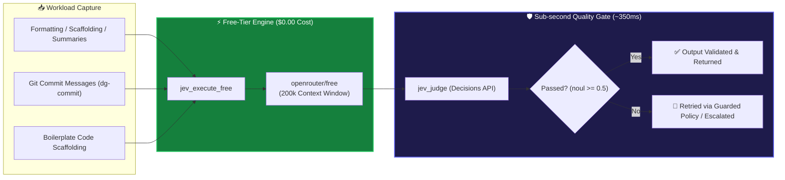
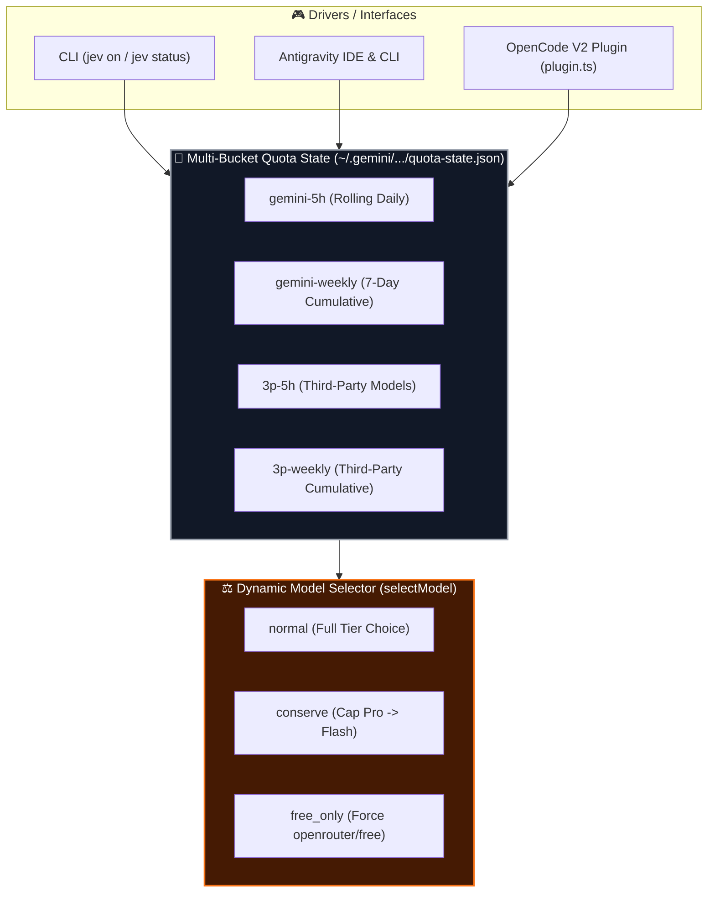

# TypeSafe Jev Plugin (Jev V2 - System 1 AI Coprocessor)

[](https://www.typescriptlang.org/)
[](https://bun.sh/)
[](LICENSE)
[](https://github.com/rockad/agentic-hub)

**Path:** `agentic-hub/plugins/jev`  
**Version:** 2.3.0  
**Runtime:** Bun / Node (ESM)  
**Dependencies:** TypeScript, Zod, OpenRouter SDK, Agent Framework Adapters

---

## 📖 Overview

The **TypeSafe Jev Plugin** (`plugins/jev`) is the **System 1 AI Coprocessor** for the `agentic-hub` ecosystem. Named after Daniel Kahneman's "System 1" (fast, intuitive, low-effort thinking), Jev handles the high-volume, low-stakes cognitive load of an AI agent loop so your primary agent (System 2) can focus on complex reasoning.

Jev acts as three things in a single layer:
1. **Probabilistic Decision Coprocessor:** Analyzes tasks and routes work to the most cost-effective execution tier before any token spend occurs.
2. **Free-Tier Offloading Engine:** Diverts boilerplate work (summaries, linting, formatting, commits) to free-tier models (`openrouter/free`), resulting in **$0.00 cost** and **0 quota consumption** for routine operations.
3. **Quality Gate Validator:** Runs sub-second micro-evaluations (`jev_judge`) to verify output quality before it reaches the user or is committed to source control.

**Primary Value Proposition:** It protects your paid subscription quota (specifically **Google AI Pro Gemini**), preventing wasted credits on routine tasks while accelerating agent loops through parallelized, cheaper execution.

---

## ✨ Key Features

### ⚙️ Operating Modes
Control the coprocessor's behavior via a toggleable state machine, persisted across sessions:

| Mode | Behavior | Use Case |
| :--- | :--- | :--- |
| `ON` | **Always Active.** Jev automatically dispatches eligible tasks and offloads free-tier work. | Daily development workflows; quota protection by default. |
| `ON-DEMAND` | **Manual Trigger.** Jev only engages when explicitly requested (via slash command). | Auditing, debugging, or when you want full manual control over costs. |
| `OFF` | **Disabled.** No offloading, no dispatching. Direct pass-through to primary model. | Emergency high-complexity tasks where free models might hallucinate. |

> Toggle anytime using the CLI (`jev on`) or the in-chat slash command (`/jev`).

### 🚀 Pre-flight Dispatch (`jev_dispatch`)
Before a task hits the primary model, `jev_dispatch` runs a calibrated inference on the task metadata. It produces a **probability distribution** over:
- **Subagents:** Which specialized helper should handle the task?
- **Execution Tiers:** `openrouter_free`, `flash_lite`, `flash`, or `pro`.

This prevents expensive models from processing routine formatting or simple search requests.

### 🆓 Free-Tier Offloading
Jev intercepts specific workload patterns and reroutes them to `openrouter/free` endpoints. This guarantees **$0.00 spend** and **0 quota usage** for:
- File/Code **Summaries**
- **Markdown** formatting and refactoring
- Standard **Git Commits** (`dg-commit`)
- Boilerplate scaffolding
- Unit test generation

**Implementation:**
- `jev_execute_free`: Raw offloading wrapper with timeout handling.
- `jev_agent_free`: Specialized handler for agent-assistant interactions.
- `jev_execute_free_guarded`: Offloading wrapped in a retry + fallback policy to ensure failure never breaks the loop.

### 📝 Automated Semantic Commits
Integrates directly with the commit pipeline via `dg-commit` (script alias) and `scripts/commit.ts`:
1. `scripts/commit.ts` captures the staged diff.
2. `jev_dispatch` decides if the commit message needs an LLM.
3. `jev_agent_free` generates a conventional commit message.
4. `jev_judge` validates the message against the diff semantically.
5. Commit is finalized.

### 🛡️ Quality Gates (`jev_judge`)
A micro-evaluation engine designed for speed. `jev_judge` runs in **~350ms** and evaluates:
- **Code Diff Integrity:** Does the change match the intent?
- **Safety Checks:** Are there exposed secrets or unsafe patterns?
- **Pre-Commit Validity:** Does the commit message accurately describe the changes?

### 📊 Quota & Model Selection (`jev_quota`, `jev_select_model`)
Real-time telemetry tracks your subscription limits to prevent hard `429` errors:
- **5-Hour Bucket:** Tracks rolling usage for the day.
- **7-Day Bucket:** Tracks cumulative usage for the week.

`jev_select_model` automatically swaps your target model to a lower-tier alternative when thresholds are approached.

### 🔌 Dual Integration
Jev ships with native adapters for both major agent frameworks:
1. **Antigravity CLI:** Deep hooks into the Antigravity action pipeline.
2. **OpenCode V2:** Native plugin hooks into the OpenCode extension architecture. *(Note: `opencode serve` background service caches plugin modules in memory. Restart the service via `pkill -f "opencode serve"` after updating plugin source versions).*
3. **Claude Code:** A plugin with the MCP server plus hooks that advise and guard each turn. See the Claude Code section below.

---

## 📐 System 1 Decision & Execution Flows

### 1. Pre-Flight Dispatch & Reasoning Effort Governance Flow

```mermaid
flowchart TD
    A["👤 User Request / Task Prompt"] --> B["⚡ Jev Pre-Flight Dispatch (jev_dispatch)"]
    
    B --> C{"🔍 Subagent & Intent Evaluator"}
    C -->|Mechanical / Formatting| D["🟢 Low Effort (low)\n(inbox_processor, syntax_formatter, git_scribe)\n-30% Tokens, Min Latency"]
    C -->|Standard Work / Vault| E["🔵 Medium Effort (medium)\n(vault_librarian, code_engineer, research)\nBalanced Reasoning Depth"]
    C -->|Complex Architecture| F["🟣 High Effort (high)\n(system_architect, security_auditor)\nMaximum CoT Depth"]
    
    D --> G{"📊 Quota Strategy Governor (readQuotaView)"}
    E --> G
    F --> G
    
    G -->|Strategy: normal| H["✅ Execute Calibrated Effort"]
    G -->|Strategy: conserve| I["⚠️ Cap High Effort -> medium"]
    G -->|Strategy: free_only (Free Model)| J["🆓 Retain medium / high on openrouter/free"]
    G -->|Strategy: free_only (Quota Model)| K["🔒 Force low Effort on Paid Quota Models"]
    
    H --> L["🤖 Subagent Execution"]
    I --> L
    J --> L
    K --> L

    style D fill:#1b4332,color:#fff,stroke:#2d6a4f,stroke-width:2px
    style E fill:#1e3a8a,color:#fff,stroke:#3b82f6,stroke-width:2px
    style F fill:#4c1d95,color:#fff,stroke:#8b5cf6,stroke-width:2px
    style G fill:#0f172a,color:#fff,stroke:#f59e0b,stroke-width:2px
```

### 2. Free-Tier Offloading & Micro-Evaluation Quality Gate



### 3. Multi-Bucket Quota Preservation Architecture



---

## 💰 Token & Cost Savings Comparison Matrix

| Workload Category | Monolithic Execution (No Jev) | TypeSafe Jev Coprocessor Engine | Paid Token Savings | Gemini Quota Burn | Latency Impact |
| :--- | :--- | :--- | :--- | :--- | :--- |
| **Mechanical Formatting & Scaffolding** | Paid Tier (`Gemini Pro` / `Flash`) @ high effort | Offloaded to `openrouter/free` via `jev_execute_free` @ `low` effort | **100% Paid Savings** | **0% Quota Burn ($0.00)** | ~600ms (Fast) |
| **Git Commit Generation (`dg-commit`)** | Primary Session Model (~2k tokens) | `jev_agent_free` + `jev_judge` validation (~350ms) | **100% Paid Savings** | **0% Quota Burn ($0.00)** | ~350ms (Sub-second) |
| **Vault Notes & Indexing (`vault_librarian`)** | High CoT reasoning budget | Calibrated `medium` effort + quota governor throttling | **~30% Token Savings** | **60% Reduced Burn** | ~1.2s |
| **Standard Feature Engineering (`code_engineer`)** | Unbounded reasoning tokens | Pre-flight `jev_dispatch` + `medium` effort governance | **~25% Token Savings** | **Optimal Quota Preservation** | ~2.5s |
| **Security Audits & RFC Architecture** | Uniform static reasoning budget | Dynamic `high` effort + `jev_judge` diff integrity check | Deepest CoT Reasoning Depth | Calibrated & Guarded | Extended CoT Depth |
| **Overall Monthly Benchmark** | High risk of 5-Hour / 7-Day Quota Exhaustion (`429`) | Guaranteed continuous operation under quota safety caps | **~45% Overall Token & Cost Savings** | **Quota Lifetime Extended 3x** | **Up to 4x Faster Turn Completion** |

---

## 🏗️ Architecture & Component Structure

```text
plugins/jev
├── src/
│   ├── index.ts             # Main MCP server & tool handlers
│   ├── opencode-runner.ts   # OpenCode execution integration
│   ├── decisions.ts         # TypeSafe Jev Decisions API adapter
│   └── telemetry.ts         # Telemetry &Phoenix span logging
├── opencode/                # OpenCode V2 plugin adapters
├── claude/                  # Claude Code hook adapter (hook.ts entry, logic.ts decisions)
├── hooks/hooks.json         # Claude Code hook registration
├── scripts/
│   ├── commit.ts            # Semantic commit generation pipeline
│   └── cli.ts               # Terminal CLI entrypoint
├── skills/
│   └── jev/                 # In-chat slash command skill
├── tests/
│   └── jev.test.ts          # Bun unit test suite
├── .env.example             # Template configuration
├── package.json
└── tsconfig.json
```

---

## ⚙️ Configuration

Create a `.env` file in the plugin root (`.env` is ignored by git via `.gitignore`).

### Required Variables

| Variable | Description | Default |
| :--- | :--- | :--- |
| `JEV_OPENROUTER_API_KEY` | **Required.** API key for OpenRouter to access free-tier endpoints. | *(None)* |
| `JEV_MODE` | Initial operating mode (`ON`, `ON-DEMAND`, `OFF`). | `ON` |

---

## 🤖 Claude Code

Install from this repository's Claude Code marketplace (`.claude-plugin/marketplace.json` at the repo root):

```
/plugin marketplace add rockad/agentic-hub
/plugin install jev@agentic-hub
```

Put the key where the hooks and the MCP server both find it: `~/.config/jev/env` with
`JEV_OPENROUTER_API_KEY=...`. `bun` must be on `PATH`.

The plugin brings the `jev_*` MCP tools and four hooks (`hooks/hooks.json` → `claude/hook.ts`).
The hooks act only in mode `on`. In `on-demand` and `off` they stay silent, and the MCP tools
remain callable on request.

| Event | What Jev does |
| :--- | :--- |
| `SessionStart`, `PostModelSwitch` | Remembers the session model in `~/.config/jev/claude-sessions/`. It is the ceiling for delegations. |
| `UserPromptSubmit` | Asks Jev (1.5 s budget) for a Claude subagent (`Explore`, `general-purpose`, `Plan`, `self`), a model (`openrouter_free`/`flash_lite` → `haiku`, `flash` → `sonnet`, `pro` → `opus`) and an effort, and adds them to the turn as context. |
| `PreToolUse` on `Agent` | Asks the user before a subagent runs on a stronger model than the session's. When Jev is reachable, it also asks when Jev rates the delegated task `pro`. |

What the hooks do **not** do:

- They never change the model of a delegation. Cheaper models are advised, not forced.
- They never block a turn. Any failure (no key, Jev down, malformed input) prints nothing and exits 0.
- They do not track Claude subscription limits. Claude Code exposes `rate_limits` only to the status
  line, not to hooks, so the quota strategy is whatever `readQuotaView` reports (usually `unknown`).

Decisions are logged to `~/.config/jev/claude_decisions.jsonl`.

---

## 📟 CLI & Slash Commands

| Command | Description |
| :--- | :--- |
| `jev` | Alias for `jev status`. Shows current quota and mode. |
| `jev status` | Displays quota bucket usage and active mode. |
| `jev on` | Sets mode to `ON` (Always Active). |
| `jev off` | Sets mode to `OFF` (Pass-through). |
| `/jev` | In-chat slash command to inspect/switch mode. |

---

## 🛠️ Development & Testing

```bash
# Install dependencies
bun install

# Run the test suite
bun test
```
