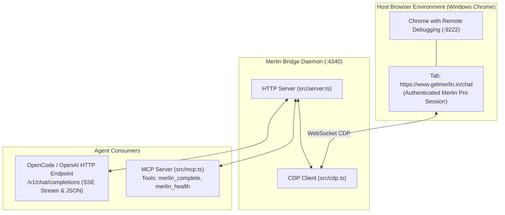

# Merlin Bridge Plugin (`@agentic-hub/merlin-bridge`)

In-browser Chrome DevTools Protocol (CDP) execution bridge and Model Context Protocol (MCP) server for [Merlin AI](https://www.getmerlin.in).

Enables AI agents (Antigravity CLI, OpenCode, Claude Code) to offload completions, boilerplate code, documentation, and reviews to an active Merlin Pro subscription at **$0 API cost** and **zero Gemini quota consumption**.

---

## Architecture Overview



- **Chrome CDP (`:9222`)**: Connects to the host's running Chrome instance via Chrome DevTools Protocol. Finds or opens `https://www.getmerlin.in/chat` where the user is authenticated.
- **Bridge Daemon (`:4340`)**: Node/Bun HTTP server executing in WSL. Manages CDP connection, evaluates commands directly in the authenticated Merlin web application context, and exposes an OpenAI-compatible HTTP interface.
- **MCP Server (`src/mcp.ts`)**: Standard Model Context Protocol server exposing tool definitions (`merlin_complete`, `merlin_health`) via stdio.
- **OpenCode & OpenAI Compatible Endpoint**: Direct streaming `/v1/chat/completions` API compatible with any OpenAI client library.

---

## Quickstart

### Prerequisites
1. Windows Chrome launched with `--remote-debugging-port=9222` (or launch via `scripts/start-bridge.sh`).
2. Logged into your account on `https://www.getmerlin.in/chat`.
3. [Bun](https://bun.sh) runtime installed.

### Start the Service

```bash
# Start background daemon
./scripts/merlin-bridge-daemon.sh start

# Check service status
./scripts/merlin-bridge-daemon.sh status
```

### Test Completion

```bash
curl -X POST http://127.0.0.1:4340/v1/chat/completions \
  -H "Content-Type: application/json" \
  -d '{
    "messages": [{"role": "user", "content": "Reply with pong if you hear me"}],
    "stream": false
  }'
```

---

## Daemon Management

The daemon manager `scripts/merlin-bridge-daemon.sh` provides lifecycle control:

| Command | Action |
| :--- | :--- |
| `./scripts/merlin-bridge-daemon.sh start` | Starts `src/server.ts` in detached background mode via `setsid` |
| `./scripts/merlin-bridge-daemon.sh stop` | Gracefully stops the running daemon process |
| `./scripts/merlin-bridge-daemon.sh restart` | Restarts the daemon service |
| `./scripts/merlin-bridge-daemon.sh status` | Queries running process and prints live `/health` status |

- **Log file**: `~/.gemini/antigravity-cli/log/merlin-bridge.log`
- **PID file**: `/tmp/merlin-bridge.pid`

---

## API Endpoint Specifications

The bridge daemon serves on `http://127.0.0.1:4340`:

### 1. `GET /health` and `GET /status`
Returns daemon health and Chrome CDP connectivity status.

**Response (`200 OK` or `503 Service Unavailable`)**:
```json
{
  "status": "ok",
  "chromePort": 9222,
  "cdpConnected": true,
  "merlinTargetFound": true,
  "targetId": "7605821A4DE6FE77FE13E9F90E51D229",
  "targetUrl": "https://www.getmerlin.in/chat",
  "uptimeSeconds": 120
}
```

### 2. `POST /v1/chat/completions`
OpenAI-compatible chat completions endpoint. Supports both JSON and Server-Sent Events (`text/event-stream`).

**Request Body**:
```json
{
  "model": "gpt-4",
  "messages": [
    { "role": "system", "content": "You are a concise assistant." },
    { "role": "user", "content": "Explain CDP in one sentence." }
  ],
  "stream": true
}
```

**Streaming Response (`text/event-stream`)**:
```
data: {"id":"chatcmpl_merlin_1791271971157","object":"chat.completion.chunk","created":1791271971,"model":"gpt-4","choices":[{"index":0,"delta":{"content":"CDP is "},"finish_reason":null}]}
data: {"id":"chatcmpl_merlin_1791271971157","object":"chat.completion.chunk","created":1791271971,"model":"gpt-4","choices":[{"index":0,"delta":{"content":"Chrome DevTools Protocol."},"finish_reason":null}]}
data: {"id":"chatcmpl_merlin_1791271971157","object":"chat.completion.chunk","created":1791271971,"model":"gpt-4","choices":[{"index":0,"delta":{},"finish_reason":"stop"}]}
data: [DONE]
```

### 3. `GET /v1/models`
Returns list of available models.

---

## MCP Server Integration

To use with Antigravity CLI or OpenCode, the server is configured in `.mcp.json`:

```json
{
  "mcpServers": {
    "merlin": {
      "command": "bun",
      "args": ["run", "plugins/merlin-bridge/src/mcp.ts"]
    }
  }
}
```

### Available Tools:
- **`merlin_complete`**: Run text generation prompts via in-browser Merlin session.
- **`merlin_health`**: Inspect bridge and CDP connection state.

---

## Configuration

Environment variables can customize default behavior:

| Variable | Default | Description |
| :--- | :--- | :--- |
| `MERLIN_BRIDGE_PORT` | `4340` | Port for the HTTP daemon |
| `MERLIN_BRIDGE_HOST` | `127.0.0.1` | Host address to bind |
| `CHROME_DEBUG_PORT` | `9222` | Chrome CDP remote debugging port |
| `MERLIN_BRIDGE_URL` | `http://127.0.0.1:4340` | Used by MCP server to contact daemon |

---

## Troubleshooting

1. **`status: "degraded"` or `cdpConnected: false`**:
   - Verify Windows Chrome is running with `--remote-debugging-port=9222`.
   - Run `curl http://127.0.0.1:9222/json/version` to test CDP availability.
   - Run `node ../chrome-browser/scripts/launch-windows.js` to start Chrome.

2. **Session / Authentication Error**:
   - Open Chrome and check `https://www.getmerlin.in/chat`.
   - If prompted to log in, complete Google/email authentication in the browser.
   - The bridge operates inside your logged-in browser session using session tokens and Cloudflare clearance automatically.

3. **Port 4340 already in use**:
   - Check existing processes with `ss -tulpn | grep 4340`.
   - Use `./scripts/merlin-bridge-daemon.sh restart` to terminate stale instances.
