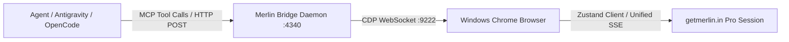

# Merlin AI CDP Bridge Skill

This skill provides AI agents (Antigravity CLI, OpenCode, Claude Code) with zero-cost inference via Aleksandr's active Merlin Pro subscription quota on [getmerlin.in](https://www.getmerlin.in). It bridges Chrome DevTools Protocol (CDP) into a standard Model Context Protocol (MCP) server and an OpenAI-compatible HTTP endpoint.

---

## Architecture & Integration



1. **Browser Layer**: Windows Google Chrome running on debug port `9222` with a logged-in Merlin Pro session on `https://www.getmerlin.in/chat`.
2. **Bridge Daemon**: Fast TypeScript daemon (`src/server.ts`) listening on `http://127.0.0.1:4340`. Translates incoming completion requests to in-page evaluations that leverage Merlin's native client stores.
3. **MCP Server**: Stdio-based server (`src/mcp.ts`) registered as `merlin` in `.mcp.json`. Exposes `merlin_complete` and `merlin_health`.
4. **OpenCode / OpenAI HTTP Endpoint**: `POST http://127.0.0.1:4340/v1/chat/completions` with streaming Server-Sent Events (SSE) support.

---

## MCP Tools Reference

### 1. `merlin_complete`
Offload arbitrary generation tasks to Merlin Pro without consuming Gemini API tokens or incurring API fees.

- **Parameters**:
  - `prompt` (`string`, required): The text prompt, query, or instruction for Merlin.
  - `model` (`string`, optional, default: `"gpt-4"`): Model requested or auto-routed by Merlin Magic. Valid options include `gpt-4` (routed to auto/Merlin Magic), `claude-sonnet-5.5`, `glm-5.3-flash`, `gpt-6-luna`, `gpt-5.5`, `gemini-3.8-flash`, `minimax-m3`.
- **Returns**: Text response generated by the Merlin Pro session.

**Example Usage**:
```json
{
  "name": "merlin_complete",
  "arguments": {
    "prompt": "Write a TypeScript interface for an authentication session token with expiresAt and claims."
  }
}
```

### 2. `merlin_health`
Check the live status of the CDP bridge connection to Chrome and the Merlin web target.

- **Parameters**: None.
- **Returns**: JSON object containing:
  - `status`: `"ok"` or `"degraded"`
  - `chromePort`: `9222`
  - `cdpConnected`: `true` | `false`
  - `merlinTargetFound`: `true` | `false`
  - `targetUrl`: Active tab URL (`https://www.getmerlin.in/chat`)
  - `uptimeSeconds`: Daemon uptime in seconds

---

## Quota Waterfall Strategy

In multi-agent and coprocessor pipelines (such as TypeSafe Jev and Antigravity orchestrators), Merlin serves as the **Free Tier / Subscription Absorber** in the quota waterfall:

```
[Task Ingest]
      │
      ▼
Is task simple boilerplate, summarization, or secondary review?
      ├── YES ──► Offload to Merlin Bridge (`merlin_complete`)
      │           • $0 API Cost
      │           • 0 Gemini 5-hour quota consumption
      │           • High-speed streaming response
      │
      └── NO  ──► Reserve Primary Gemini Pro / Claude Opus quota
```

### Best Tasks for Merlin Offloading:
- Writing boilerplate code, unit test templates, and interface types.
- Summarizing transcripts, web pages, or large documentation chunks.
- Generating draft changelogs, commit messages, and PR descriptions.
- Drafting initial responses or alternative implementations.

---

## Daemon Management

The bridge daemon is managed via `scripts/merlin-bridge-daemon.sh`:

```bash
# Check service status and health
$HOME/projects/agentic-hub/plugins/merlin-bridge/scripts/merlin-bridge-daemon.sh status

# Start daemon in background
$HOME/projects/agentic-hub/plugins/merlin-bridge/scripts/merlin-bridge-daemon.sh start

# Stop daemon
$HOME/projects/agentic-hub/plugins/merlin-bridge/scripts/merlin-bridge-daemon.sh stop

# Restart daemon
$HOME/projects/agentic-hub/plugins/merlin-bridge/scripts/merlin-bridge-daemon.sh restart
```

Logs are written to `~/.gemini/antigravity-cli/log/merlin-bridge.log`.
PID is tracked in `/tmp/merlin-bridge.pid`.

---

## Fallback & Recovery

1. **Chrome target not running**:
   If `merlin_health` reports `status: "degraded"` or `cdpConnected: false`, launch Windows Chrome via:
   ```bash
   node $HOME/projects/agentic-hub/plugins/chrome-browser/scripts/launch-windows.js
   ```
2. **Session expired**:
   If Merlin responses return session errors, navigate Chrome to `https://www.getmerlin.in/chat` and ensure the user is logged into their Merlin Pro account.
